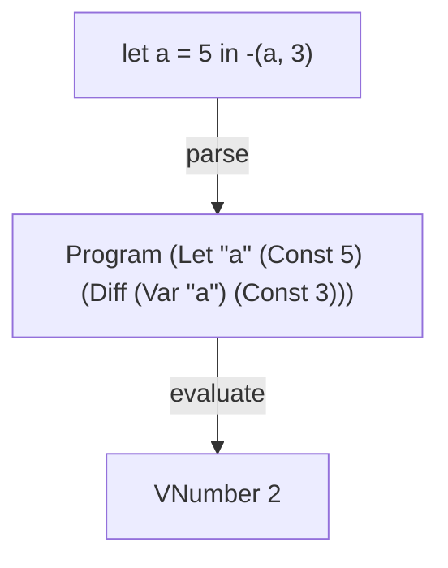

# LET

A tiny interpreter in Elm that adds let expressions and shows how environments support local bindings, scope, and variable shadowing.

LET builds on [VAR](https://github.com/tinyinterpreters/var) by allowing programs to introduce names of their own.

Read [LET: Adding Local Bindings to a Tiny Interpreter in Elm](https://blog.tinyinterpreters.dev/posts/let) for a guided explanation of how it works.



## Usage

You'll need [Nix](https://zero-to-nix.com/start/install/) with flakes enabled.

From the repository root, enter the development environment and start the Elm REPL:

```bash
nix develop
elm repl
```

Import the interpreter and run a program:

```elm
import LET.Interpreter as I

I.run "let a = 5 in -(a, 3)"
-- Ok (VNumber 2)
```

## Language

LET supports the constants, difference expressions, `zero?` expressions, conditional expressions, and variable expressions introduced by the previous interpreters.

It also adds let expressions:

```txt
let name = expression in body
```

The expression between `=` and `in` is the **bound expression**. The expression after `in` is the **body**. Both can be any expression supported by the language, including another `let`.

A binding can hold either a number or a Boolean:

```elm
I.run "let a = zero?(0) in if a then 2 else 3"
-- Ok (VNumber 2)
```

An identifier contains one or more lowercase letters. The words `if`, `then`, `else`, `let`, and `in` are reserved and cannot be used as identifiers.

The initial environment still provides `x = 10`, `v = 5`, and `i = 1`.

## Local bindings and scope

The evaluator first evaluates the bound expression in the current environment. It then extends that environment with the new binding and evaluates the body. The body's value becomes the value of the complete let expression.

The new binding's scope is the body. It is unavailable in its own bound expression, where a reference to the same name uses the surrounding environment.

An inner binding can shadow an outer binding without changing the original environment:

```elm
I.run "let a = 5 in -(let a = 3 in a, a)"
-- Ok (VNumber -2)
```

The inner body uses `a = 3`. The second operand of the difference still uses `a = 5`, so the result is `3 - 5`.

The bound expression is evaluated even when the body never uses the binding. If it fails, evaluation stops with that error and the body is not evaluated.

## Tiny Interpreters

LET is part of [Tiny Interpreters](https://blog.tinyinterpreters.dev), where we learn how programming languages work by building tiny interpreters.
