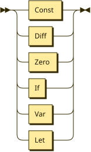
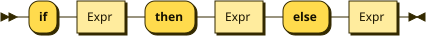
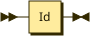
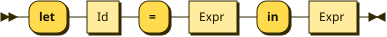
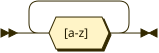

**Program:**


```
Program  ::= Expr
```

**Expr:**



```
Expr     ::= Const
           | Diff
           | Zero
           | If
           | Var
           | Let
```

referenced by:

* Diff
* If
* Let
* Program
* Zero

**Const:**


```
Const    ::= Number
```

referenced by:

* Expr

**Diff:**


```
Diff     ::= '-' '(' Expr ',' Expr ')'
```

referenced by:

* Expr

**Zero:**


```
Zero     ::= 'zero?' '(' Expr ')'
```

referenced by:

* Expr

**If:**



```
If       ::= 'if' Expr 'then' Expr 'else' Expr
```

referenced by:

* Expr

**Var:**



```
Var      ::= Id
```

referenced by:

* Expr

**Let:**



```
Let      ::= 'let' ( Id '=' Expr )+ 'in' Expr
```

referenced by:

* Expr

**Number:**


```
Number   ::= [0-9]+
```

referenced by:

* Const

**Id:**



```
Id       ::= [a-z]+
```

referenced by:

* Let
* Var

## 
 <sup>generated by [RR - Railroad Diagram Generator][RR]</sup>

[RR]: https://www.bottlecaps.de/rr/ui